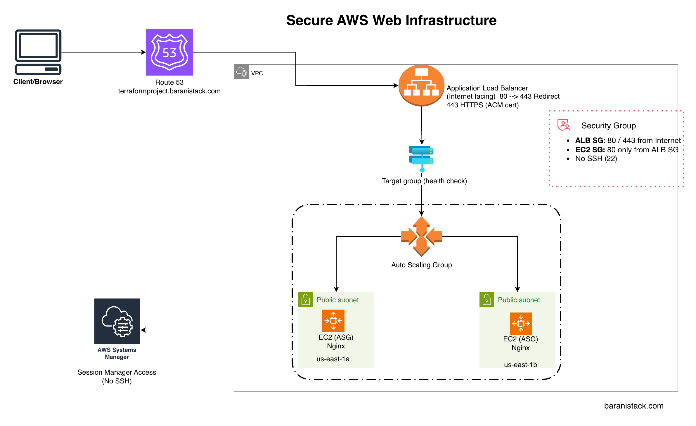

# AWS Secure Web Infrastructure using Terraform

This project provisions a secure and scalable web infrastructure on AWS using Terraform.

It includes VPC, Application Load Balancer, Auto Scaling Group running Nginx, and HTTPS using ACM. The application is accessible through a custom Route53 subdomain and instances are not directly exposed to the internet.

The goal was to implement a production-aligned web tier with proper separation between public and application layers.

---

## Solution Overview

The infrastructure consists of:

- Custom VPC
- Multi-AZ public subnets
- Internet Gateway and routing
- Application Load Balancer (ALB)
- Target Group with health checks
- Auto Scaling Group (Launch Template with Nginx on Amazon Linux 2023)
- IAM role for secure Systems Manager (SSM) access
- HTTPS listener (443) with ACM certificate
- HTTP to HTTPS redirect (port 80 → 443)
- Route53 Alias record for custom subdomain

### Traffic Flow

Client (Internet)

→ Route53 (terraformproject.baranistack.com)  
→ Application Load Balancer (HTTPS 443)  
→ Target Group  
→ Auto Scaling Group instance  
→ Nginx web server 

Application instances are not publicly accessible. Only the ALB is internet-facing.

---

## Security Architecture

Security was implemented with layered controls:

- ALB security group allows inbound HTTP (80) and HTTPS (443)
- HTTP requests are redirected to HTTPS
- TLS certificate managed in ACM and attached to ALB HTTPS listener
- ASG instance security group allows port 80 only from ALB security group
- No SSH access (port 22 not exposed)
- Administration via AWS Systems Manager (Session Manager)

This design enforces separation between the public entry point and the compute layer.

---

## Infrastructure Design Principles

- Modular Terraform architecture
- Reusable VPC, ASG, and ALB modules
- Environment-based structure (envs/dev)
- Infrastructure lifecycle managed via Terraform
- Designed with cost-efficiency considerations while maintaining production-aligned architecture.

---

## Project Structure
```
aws-secure-web-infra-terraform/
|
|-- modules/
|     |--- vpc/
|     |--- asg-web/
|     |--- alb/
|
|-- envs/
|     |--- dev/
|
|-- docs/
      |--- screenshots
```

Each module is independently reusable and parameterized.

---

## Deployment

Initialize and deploy:

```
cd envs/dev
terraform init
terraform plan
terraform apply
```

After deployment, retrieve the application endpoints:

```
terraform output alb_url
terraform output alb_https_url
```
---

## Teardown

To prevent unnecessary AWS charges:
```
cd envs/dev
terraform destroy
```

---

## Key Implementation Highlights

- ALB + ASG based web architecture
- Launch Template bootstraps Nginx using user_data
- HTTPS enabled using ACM
- HTTP to HTTPS redirect configured at ALB level
- Custom domain mapped using Route53
- SSM used for secure instance access (no SSH)

---

## Validation

Screenshots in `/docs/screenshots` demonstrate:

- ACM certificate issued
- ALB listeners configured (80 redirect, 443 HTTPS)
- Target group shows healthy ASG instance
- HTTPS access verified using custom domain
- SSM Session Manager access validated

## Architecture Diagram


